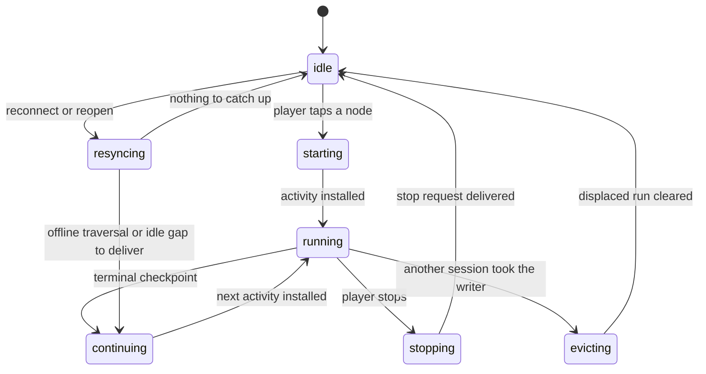
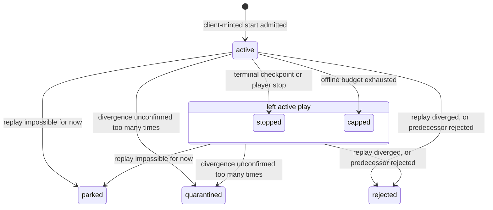

# Game lifecycle

The client authors every activity and simulates it locally. The server admits what the client
submits, proves it later by replay, settles one avatar's activities in the order they were played,
and pays only what it has proved. Most wrong turns in this area come from the conventional
server-authoritative model, so drop the assumptions below before you open a file.

## Assumptions to drop

- **The server creates activities.** The client mints the activity start from materials it cached at
  reveal and starts simulating with no round trip. The server admits a client-minted start: it
  re-derives every input from its own truth and refuses a mismatch.
- **The server simulates on the request path.** A queue-fed verifier in the replay service re-runs
  submitted checkpoints later. No request handler simulates.
- **A checkpoint hash proves the outcome.** The hash links the previous checkpoint and nothing more.
  Replay is the proof.
- **Verified is a status.** Proof is a cursor. `verified_head` on the head row and the verified
  anchor on the chain row say how far the server has proved. The status column says only whether the
  run is `active`, `stopped`, `capped`, `rejected`, `parked`, or `quarantined`.
- **A terminal checkpoint completes the row.** A `completed` or `failed` checkpoint moves the status
  to `stopped`, the same status a player stop writes. The last checkpoint's type says how the run
  ended.
- **Activities settle independently.** The server settles one avatar's activities one at a time, in
  the play order the client declares through `predecessorActivityId`. A held predecessor blocks its
  successors, and a rejected one fails them.
- **Rewards apply when the client says so.** The client renders optimistic state. The server pays
  only positions at or below the verified anchor, and a rejection rewinds the appended anchor
  without clawing back anything already settled.
- **Retrying a node re-rolls it.** The seed chain is one forward sequence per avatar and node. A
  failed attempt spends its positions, and the next attempt continues past them.
- **A parked activity is a cheat verdict.** Parked and quarantined are operational holds that stop
  the avatar's settlement until an operator acts. Only reproducible divergence under a matched sim
  version is rejected as cheating.
- **`mint` means the server inserts a start.** In this area the client mints an activity start and
  the server admits it. The server mints continuation rows on the catch-up path and chain rows at
  reveal.

## Reading order

Read all three docs in full before you open a file. The code is split one export per file, so no
single file shows a flow.

1. `docs/architecture/game/game-simulation.md` — the deterministic core, checkpoint streams, replay,
   and what settlement applies.
2. `docs/architecture/game/seed-chain.md` — positions, the two anchors, what moves each, and the
   order the verifier claims work in.
3. `docs/architecture/game/offline-reconcile.md` — the connectivity states, fast-forward, settlement
   in order, held activities, and the worker lifecycle.

## State machines

One writer worker per browser profile owns every activity transition on the client. Its flows run
one at a time.

The server keeps one status per activity row. Proof moves on a separate cursor under every status
below, so a `stopped` row can be fully verified, partly verified, or not yet claimed.

## Where each concept lives

| Concept                                         | File                                                                  |
| ----------------------------------------------- | --------------------------------------------------------------------- |
| client lifecycle owner, the worker states above | `libs/game/idle-client/src/worker/worker-lifecycle-machine.ts`        |
| resync: what a reconnect or reopen catches up   | `libs/game/idle-client/src/worker/run-resync-flow.ts`                 |
| durable outbox and its flush                    | `libs/game/idle-client/src/submission/create-checkpoint-submitter.ts` |
| start admission and offline catch-up            | `services/activity/src/handlers/advance-activity.ts`                  |
| checkpoint append, budget, terminal transition  | `services/activity/src/handlers/track-activity-progress.ts`           |
| the verifier's claim order                      | `services/replay/src/queue/find-replay-target.ts`                     |
| replay and adjudication                         | `services/replay/src/worker/run-replay-target.ts`                     |
| settlement of a proved segment                  | `services/replay/src/apply/apply-verified-segment.ts`                 |
| rejection and the anchor rewind                 | `services/replay/src/worker/reject-activity.ts`                       |
