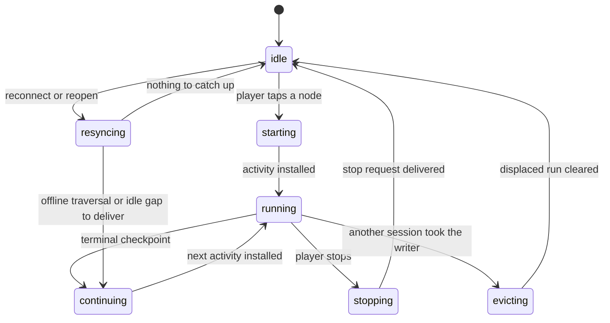
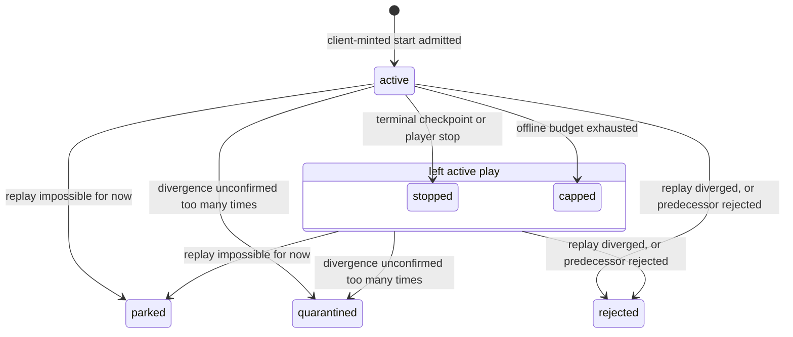

# Game lifecycle

The client authors every activity and simulates it locally. The server admits what the client
submits, proves it later by replay, settles one avatar's activities in the order they were played,
and pays only what it has proved. A file read through the conventional server-authoritative model
looks like a contradiction of the docs, and the docs are right.

## What's true in this system

- **The client creates every activity.** The worker mints the activity start from the inputs it
  cached at node reveal and starts simulating with no round trip. The server admits that activity
  start by re-deriving every input and refusing a mismatch. A conventional backend creates the
  record itself.
- **The request path never simulates.** A queue-fed verifier in the replay service re-runs submitted
  checkpoints later. A conventional backend validates the move inside the request.
- **The checkpoint hash links, and replay proves.** The hash binds a checkpoint to the previous one
  and attests no outcome, so only a replay under the pinned sim version validates a reward.
- **Proof is a cursor, never a status.** `verified_head` on the head row and the verified anchor on
  the chain row say how far the server has proved. The status column says only whether the run is
  `active`, `stopped`, `capped`, `rejected`, `parked`, or `quarantined`. There is no `verified`
  status.
- **A terminal checkpoint writes `stopped`.** A `completed` or `failed` checkpoint and a player stop
  move the activity row to the same status. The last checkpoint's type says how the run ended.
- **One avatar's activities settle in play order.** The client declares the order through
  `predecessorActivityId`. The verifier claims an activity only once its predecessor has settled or
  the verifier has rejected it. A held predecessor blocks its successors, and a rejected one fails
  them.
- **The server pays only what it has proved.** The client renders optimistic state. The server pays
  for positions at or below the verified anchor. A rejection rewinds the appended anchor and
  reverses no payout already made.
- **A node never re-rolls.** The seed chain is one forward sequence per avatar and node, so a failed
  attempt spends its positions and the next attempt continues past them.
- **Parked and quarantined are holds, not verdicts.** Each stops the avatar's settlement until an
  operator acts. The verifier rejects only reproducible divergence under a matched sim version as
  cheating.
- **The client mints an activity start, and the server admits it.** The server mints continuation
  rows on the catch-up path and chain rows at node reveal, so `mint` in a server handler names one
  of those and never an activity start.

## Reading order

Read all three docs in full before you open a file. The code is split one export per file, so no
single file shows a flow.

1. `docs/architecture/game/game-simulation.md` — the deterministic core, checkpoint streams, replay,
   and what settlement applies.
2. `docs/architecture/game/seed-chain.md` — positions, the two anchors, what moves each, and the
   order the verifier claims work in.
3. `docs/architecture/game/offline-reconcile.md` — the connectivity states, fast-forward, settlement
   in order, held activities, and the worker lifecycle.

## State machines

One writer worker per browser profile owns every activity transition on the client. Its flows run
one at a time.

The server keeps one status per activity row. Proof moves on a separate cursor whatever the status,
so a `stopped` row can be fully verified, partly verified, or not yet claimed.

## Where each concept lives

| Concept                                        | File                                                                  |
| ---------------------------------------------- | --------------------------------------------------------------------- |
| client lifecycle owner and its worker states   | `libs/game/idle-client/src/worker/worker-lifecycle-machine.ts`        |
| resync: what a reconnect or reopen catches up  | `libs/game/idle-client/src/worker/run-resync-flow.ts`                 |
| durable outbox and its flush                   | `libs/game/idle-client/src/submission/create-checkpoint-submitter.ts` |
| start admission and offline catch-up           | `services/activity/src/handlers/advance-activity.ts`                  |
| checkpoint append, budget, terminal transition | `services/activity/src/handlers/track-activity-progress.ts`           |
| the verifier's claim order                     | `services/replay/src/queue/find-replay-target.ts`                     |
| replay and adjudication                        | `services/replay/src/worker/run-replay-target.ts`                     |
| settlement of a proved segment                 | `services/replay/src/apply/apply-verified-segment.ts`                 |
| rejection and the anchor rewind                | `services/replay/src/worker/reject-activity.ts`                       |
