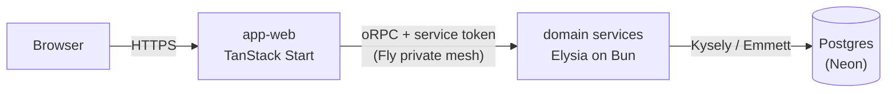

# Overview

Vers is a browser idle game on a microservice backend: a deterministic simulation runs on the
client, the server verifies its results by replay, and everything deploys from one repo as a single
atomic release.

## Request path

The web app is the only public-facing deployment. Its TanStack Start server renders the UI and is
the trust edge: it terminates the user's session, mints a short-lived signed service token carrying
the acting user's ID, and calls domain services through typed oRPC contract clients over Fly's
private mesh. Services verify that token on every call, do their work against Postgres on Neon, and
return typed results.

The oRPC link is isomorphic: during SSR the Start server calls services directly; in the browser,
calls go through the app's `/api/rpc` proxy route, since services are not reachable from the public
internet. Either way the client is typed by the service's contract package alone — see
[service contracts](./002-service-contracts.md).

## Topology

Each service is its own Fly deployment, scale-to-zero, reachable only on the private mesh:

- `service-user`, `service-session`, `service-verification` — the identity platform: accounts,
  sessions (RS256 JWTs signed by the session service), and the OTP/TOTP verification flows. The auth
  design is specified in [auth](./001-auth.md).
- `service-avatar` — the game-domain service: avatars and their progression.
- `service-activities` — owns the game's event store: activity streams of simulation checkpoint
  batches, and the "current activity" / "latest progress" reads the client resumes from.
- `service-verifier` — queue-fed checkpoint-replay worker. Replaying a simulation is CPU-bound, so
  verification runs off the request path with its own scaling profile.

Email is a library (`lib-email`, a Resend wrapper), not a service — services send directly.

## Data

One database, two shapes. Both live in the same Postgres on Neon, which scales to zero when nobody
is playing.

- **Relational identity data** — users, sessions, verifications, avatars — accessed through Kysely,
  migrated by `db-postgres`.
- **Event-store checkpoints** — via Emmett, one stream per activity. The workload is append-heavy
  checkpoint batches, point reads for "latest progress", and rare full replays — a natural fit for
  indexed Postgres, with optimistic concurrency (`UNIQUE(stream_id, version)`) backing the
  checkpoint hash chain. Emmett is backend-agnostic, so a purpose-built event store remains a
  drop-in swap if one is ever warranted.

## Game layer

The simulation is deterministic: a seeded tick engine (`lib-idle-core`) runs combat in a
SharedWorker on the client (`lib-idle-client`, cross-tab, fixed-timestep), emitting a stream of
hash-chained checkpoints. Encounter derivation is a pure function of node seed and difficulty living
in the shared libs — not a service — so client and verifier compute identical encounters from the
same inputs.

Checkpoint batches are submitted to the activities service; the verifier replays the same seeds
server-side and compares results before progress is trusted. Checkpoint hashes chain the stream
together but don't attest combat outcomes — replay is the proof. The same replay path generates
offline progress: simulate forward from the last verified checkpoint.

The star map (`lib-aether-*`) generates the world graph — concentric difficulty rings of baked nodes
— and renders it with three.js via react-three-fiber.

## Cross-cutting

- **Service-to-service auth** — services trust no caller, private mesh included. Every request
  carries a short-lived signed service token minted at the edge with the acting user's ID; the
  runtime plugin in `lib-service-runtime` verifies it before any handler runs.
- **Contracts** — each service's API is declared in its own `@vers/contract-*` package, oRPC
  contract-first with Zod schemas owned by the contract that declares them. Mechanics, error
  taxonomy, and change discipline: [service contracts](./002-service-contracts.md).
- **Atomic release** — contracts are unversioned workspace source packages; the repo deploys as one
  unit from one SHA. Turborepo re-typechecks every consumer on any contract change, so divergence
  cannot land on `main`. There is no version matrix — the monorepo is the compatibility mechanism.
- **Observability** — OpenTelemetry and Sentry are wired into every service by
  `lib-service-runtime`; request IDs propagate edge to service.

## Core technology

Frontend:

- UI - [React](https://react.dev) 19 with the
  [React Compiler](https://react.dev/learn/react-compiler)
- Framework - [TanStack Start](https://tanstack.com/start) (SSR + server functions)
- Data Fetching - [TanStack Query](https://tanstack.com/query)
- State Management - [Zustand](https://zustand-demo.pmnd.rs)
- 3D Graphics - [Three.js](https://threejs.org), [@react-three/fiber](https://r3f.docs.pmnd.rs)
- Component Library - [Ark UI](https://ark-ui.com)
- Styling - [Panda CSS](https://panda-css.com)

Backend:

- Runtime - [Bun](https://bun.sh)
- Web Server - [Elysia](https://elysiajs.com)
- API Layer - [oRPC](https://orpc.unnoq.com), contract-first
- Database - [PostgreSQL](https://postgresql.org) on [Neon](https://neon.tech) via
  [Kysely](https://kysely.dev)
- Event Store - [Emmett](https://event-driven-io.github.io/emmett/)
- Authentication - [TOTP](https://github.com/epicweb-dev/totp),
  [jose](https://github.com/panva/jose), `Bun.password` (argon2id)
- Email - [React Email](https://react.email), [Resend](https://resend.com)

Development:

- Build - [Vite](https://vitejs.dev), [esbuild](https://esbuild.github.io)
- Testing - [Vitest](https://vitest.dev), [Playwright](https://playwright.dev),
  [MSW](https://mswjs.io)
- Monorepo - [Turborepo](https://turborepo.dev) + [Bun](https://bun.sh) workspaces
- Type Safety - [TypeScript](https://typescriptlang.org), [Zod](https://zod.dev)
- Monitoring - [Sentry](https://sentry.io), [OpenTelemetry](https://opentelemetry.io)
- Hosting - [Fly.io](https://fly.io) (compute), [Neon](https://neon.tech) (data)

## Projects

Applications & services:

- `app-web` - TanStack Start web app; the trust edge and only public deployment
- `app-web-e2e` - e2e test suite for the web app
- `db-postgres` - postgres migration runner (Kysely migrations against Neon)
- `service-activities` - game activity event store (Emmett streams of checkpoint batches)
- `service-avatar` - avatar domain service
- `service-session` - session domain service
- `service-user` - user domain service
- `service-verification` - OTP/TOTP verification domain service
- `service-verifier` - queue-fed checkpoint-replay verification worker

Libraries:

- `lib-aether-client` - client code (react, three, zustand) for the aether star map
- `lib-aether-core` - platform-agnostic aether graph generation
- `lib-client-test-utils` - react & web worker testing utilities
- `lib-contract-<service>` - one per service: that service's oRPC API declaration
- `lib-contract-base` - shared contract error taxonomy, base builders, and conformance-test helper
- `lib-data` - core static game data
- `lib-design-system` - ui component library (Ark UI primitives + Panda recipes)
- `lib-email` - Resend wrapper and react-email template factories
- `lib-game-utils` - shared game logic (encounter derivation, rewards)
- `lib-idle-client` - client code (react, zustand, SharedWorker) for the idle simulation
- `lib-idle-core` - deterministic seeded simulation engine
- `lib-panda-preset` - design tokens & panda css config
- `lib-postgres-schema` - postgres table definitions & Kysely database types
- `lib-service-runtime` - Elysia service runtime: createService, s2s auth, health, logging,
  OTel/Sentry wiring
- `lib-service-test-utils` - postgres test container & mock data utils
- `lib-styled-system` - generated code for panda css design system
- `lib-utils` - low-level platform-agnostic utils
- `lib-validation` - shared zod schemas
