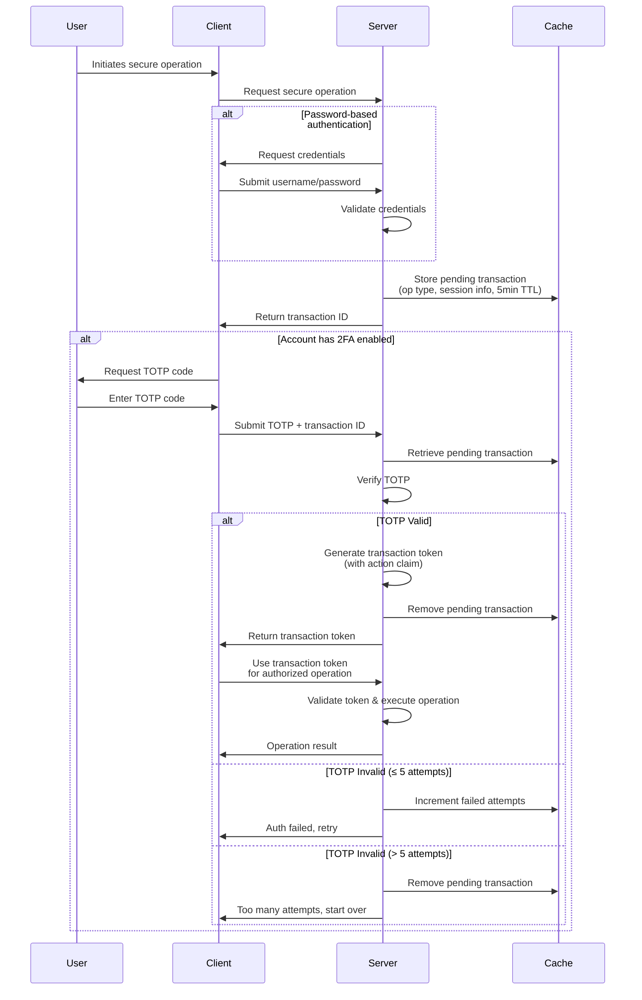

# Auth

The authentication and authorization system has five components:

1. **Basic authentication** — username/password as the first authentication factor.
2. **Two-factor authentication (2FA)** — optional TOTP-based 2FA for additional account security.
3. **Transaction tokens** — short-lived, single-use tokens that bind TOTP verification to secure
   operations.
4. **Step-up authentication** — additional verification for sensitive operations.
5. **Password reset** — secure, one-time-use tokens.

## TOTP

Time-based One-Time Passwords (TOTP) verify:

- email verification during sign-up
- email change verification
- two-factor authentication during login
- step-up authentication for sensitive operations

## Transaction tokens

A secure operation that requires additional verification runs as:

1. A pending transaction record is created in a short-lived (5-minute) server cache, holding the
   intended operation type, session information, and user context.
2. A unique transaction ID is returned to the client.
3. The client submits the transaction ID with a valid TOTP to complete the operation.
4. On successful verification, a short-lived (5-minute), one-time-use transaction token is issued,
   carrying an `action` claim that names the authorized operation.
5. The pending transaction is removed from the cache to prevent replay attacks.

## Security measures

- Failed TOTP verification attempts against a pending transaction are limited to 5; after 5 failed
  attempts the pending transaction is purged to prevent brute force.
- One-time use is enforced with a JTI (JWT ID) blocklist.
- All sensitive tokens have a maximum lifetime of 5 minutes.
- Password reset tokens are exposed only via URLs in the reset emails.
- Step-up authentication is required for sensitive operations (e.g., email change, security
  settings).

## Authentication flow

