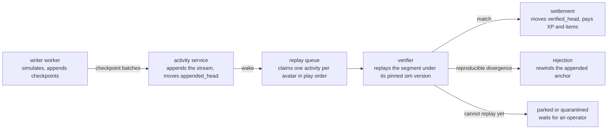

# Game simulation

The client computes and records all gameplay, and the server decides by replay whether to trust it.
The client runs every real-time simulation as a pure function of a fixed set of inputs and a seeded
random stream, and writes each step to an append-only checkpoint stream. The server never simulates
on the request path: a queue-fed verifier re-runs the submitted checkpoints later and decides
whether to trust them. The same inputs re-run to byte-identical results, which is what lets the
verifier check a stream it did not compute and lets a returning client rebuild simulation state it
no longer holds. [Replay verification](./replay-verification.md) owns the verifier and settlement.
[Offline reconcile](./offline-reconcile.md) owns the delivery of offline progress on reconnect and
the worker lifecycle that drives it.

A checkpoint's path from the client to settled progress runs through four owners.

## Activities and encounters

An **activity** is one attempt at a piece of content, recorded as a single append-only checkpoint
stream and verified as a unit. Every activity has a type. A **world-map encounter** is the type
where an avatar fights through a map node's enemies, arranged in **waves** — ordered enemy groups
the avatar clears one at a time. Each activity type supplies an `ActivityExecutor` that advances its
simulation. **Combat** is how a world-map encounter resolves: each tick, its executor advances the
avatar and the current wave's enemies and dispatches their attack events.

`@vers/idle-core` runs any activity type. `@vers/game-utils` derives a world-map encounter's waves,
enemies, and timing from `(node, seed, content)` as a pure function.

Activities at the same target chain together: each `(avatar, chain scope)` pair owns one append-only
[seed chain](./seed-chain.md). A **chain scope** is a stable, returnable target — a world-map
encounter's scope is its map node (`world_map_node`). The activity type says what the avatar does;
the scope type says where it returns to.

## The deterministic core

The simulation is a pure function: a fixed set of inputs plus a seeded random stream fully determine
every tick. Both the client and the server run it from the same shared libraries (`@vers/idle-core`,
`@vers/game-utils`), so they compute byte-identical results from identical inputs.

Purity rests on three invariants:

- **Every random draw comes from the seeded stream.** No draw reads `Math.random` or a wall clock.
- **Every entity id derives from its position in the input.** An enemy's id comes from its wave
  index and its slot within the wave, never from a randomly minted value.
- **Combat events resolve into one total order.** Events sort by ascending event time. Two rules
  break a tie at an equal timestamp: the avatar's own events come first; then the monotonic sequence
  number the executor stamps on each event as it schedules it. The order never depends on an event
  id or on the scan order that discovered the event that tick.

The client does all real-time simulation. One writer per browser profile runs the fixed-timestep
loop; every other tab is a viewer that renders the writer's **sim snapshot**, the engine's
serializable projection from `getSnapshot()`. The sim snapshot is distinct from the **build
snapshot**, the avatar's equipment, passives, and level pinned as a simulation input. When a run
ends, the writer broadcasts the run's outcome beside the snapshot, so a viewer learns the run ended
without waiting for another tick.

## Authoring and verifying inputs

The client authors every activity input; the server verifies it. Starting an activity is one
unconditional local step: the client builds the **activity start**, the activity's first record
naming the node, seed, and content and version stamps, from materials it cached at reveal, and drops
into the simulation with no server round trip. The same local build covers every start, whether it
is the player tapping a node, an auto-continuation after a terminal checkpoint, or an offline gap
caught up on reconnect. The server authors no start on the request path.

The client anchors each start at the seed chain's current appended anchor, which `revealNodes`
delivers alongside the seed (see [seed chain](./seed-chain.md)). It persists the synthesized start
to the durable pending-activity-starts store before installing it, so a crash between building the
start and installing it loses nothing. It queues the activity's checkpoints through the durable
checkpoint submitter, which lands them whenever the server is next reachable. The server holds no
row for the activity until that start lands. A client read keyed on the activity id — the run's
revealed rewards — waits for the ingest rather than asking after a run the server has never seen.

`advanceActivity` is the server's authority over a client-authored start. It re-derives every
authoritative input from its own truth and trusts none of the payload:

- It runs the sim-version admission check every start passes. It does not check node reachability at
  admission: an offline gap can legitimately reach a neighbour whose opening clear the server has
  not yet verified, so [replay](./replay-verification.md#replay) adjudicates reachability instead.
- It derives the encounter node and its hashed stamps from the server's own content document, never
  the payload.
- It re-authors the `buildSnapshot` from the avatar's progression, and rejects a start whose
  predicted snapshot does not match.
- It recomputes the `startHash` from the server-derived encounter and stamps, and requires the
  submitted hash to equal it. The match proves the client simulated against the same content and
  encounter the server derives.
- It validates the submitted `seed` and `startChainIndex` against the seed chain's live appended
  anchor, and refuses a start computed against a position the seed chain has moved past.

The client predicts the `buildSnapshot` as the previous run's start snapshot plus that run's own
unsettled XP, read from the run's last checkpoint and running XP total the worker holds, never from
its outbox. The server folds the same rule from its own rows: the avatar's settled XP plus every
appended-but-unverified run's contribution. A worker that holds no record of the previous run — a
fresh device, or one whose previous run the server closed — mints from the snapshot the server folds
and returns beside the avatar's latest activity, and stamps that activity as the predecessor. A
start that arrives before the worker has resynced the avatar waits for that resync first, so a
reloaded worker never mints from an empty record.

A single `advanceActivity` request carries a whole run of continuations, so an offline gap the
client simulated locally verifies in one round trip. Every continuation reuses the start's seed
chain and its pinned encounter and version context, and the server re-derives each continuation's
build the same way it re-derives the start's. The stored activity row carries the same columns
whichever path delivered it, so the replay verifier reproduces it unchanged.

### What replay pins

The **`Started` checkpoint**, the activity's first checkpoint row, pins every input a replay needs:
the sim and content versions, the roll `keyVersion`
([game entropy](./game-entropy.md#version-pinning)), and `start_chain_index`
([seed chain](./seed-chain.md#positions-on-the-chain)). Each later segment — a run of checkpoints
under one sim version — replays under the code and content its stamps name.

The activity's own id carries no cryptographic role. Its `startHash` digests only
`[seed, simVersion, contentVersion, keyVersion, encounterNode]`, because that tuple already
identifies the stream uniquely. A checkpoint's `version` — its position in the stream — and its link
to the previous checkpoint's hash, never the activity id, keep one activity's checkpoints from
crossing into another's. The id is a client-assigned label: the caller of `advanceActivity` assigns
each continuation's id itself, so the client can compute a whole fast-forward run with no per-row
round trip.

A node's encounter parameters are fixed at the content version the start pins and freeze onto the
start row, inherited unchanged by every continuation in the same request. They fold into the
`startHash`, so a later content change cannot alter an activity already in flight.

The server gates build mutations while an activity is active: a level-up renders optimistically and
applies between activities. A build snapshot that cannot change mid-activity is what makes a replay
exact.

## Checkpoint streams

Each activity is one append-only stream: one checkpoint row per step, keyed
`(activity_id, version)`, where `version` is the row's position in the stream. A single **head row**
carries the stream's two cursors, its last checkpoint hash, and the activity status. `appended_head`
tracks how far the client has written; `verified_head` tracks how far the verifier has trusted.

- **Each checkpoint links the last.** A checkpoint hashes a frozen set of fields: its position in
  the seed chain, its seed and next seed, and its `time`, `type`, and `entropySource`. It also
  includes the previous checkpoint's hash. The set never gains, loses, or repurposes a field. Its
  seed-chain position sits inside the hash, so replay reproduces every reward coordinate keyed on it
  ([seed chain](./seed-chain.md)), and its entropy-source tag makes a checkpoint's provenance
  derivable from the stream alone.
- **The hash links the previous checkpoint, it does not prove an outcome.** Rewards ride outside the
  hashed set as `+`/`-` deltas in an open keyed map, and only a replay validates them.
- **A batch carries at most 500 checkpoints.** The contract refuses a longer batch. A live flush of
  a longer queue sends the first 500 and the remainder on the flush that follows the
  acknowledgement.
- **An append is a guarded update of the head row.** The append advances `appended_head` only if the
  head still holds its expected value; a stale head returns a retryable conflict carrying the
  current head, and the client resends the tail. Resubmission deduplicates on its own —
  `UNIQUE(activity_id, version)` plus deterministic checkpoint content — and dedupe runs before
  elapsed-time accounting, so a replayed tail never inflates duration.
- **Each activity has one writer.** The head row stamps the session allowed to append, and resuming
  on a new session takes the writer over. Writer ownership is per activity, never per account. The
  account's single verified session is a separate rule
  ([auth](../services/auth.md#session-lifecycle)): evicting a session signs its device out entirely
  rather than demoting it. An append from any other session fails fatally, so a displaced writer's
  in-flight submissions die rather than interleave. A terminal status — stopped, rejected, capped,
  quarantined — rejects any later append. Together these resolve every race between logout, forced
  logout, stop, rejection, and cap.

## The offline budget

Offline progress is bounded by a per-avatar simulated-time meter, enforced on the append path. The
budget refills at wall-clock rate since it was last banked, never past the cap
(`OFFLINE_PROGRESS_CAP_MS`, 24h). Every accepted checkpoint batch debits its simulated-time delta:
the last checkpoint's cumulative `time` minus the head row's accounted time, never a sum of the
batch's per-checkpoint times.

Because the only credit source is elapsed wall clock, no path earns simulated time faster than real
time — not activity cycling, not stop/start, not avatar rotation. Live play self-funds: each flush
banks roughly the wall clock it consumes. A small initial grant on the meter absorbs tick-boundary
and network jitter.

One exception: a QA avatar's meter refills at 20 times the elapsed wall clock, so a run under the
[QA speed multiplier](../../runbooks/qa.md#debug-hook) self-funds the way a real-time run does; the
cap still applies.

A batch whose delta exceeds the accrued budget is rejected whole, and the activity takes the
terminal `capped` transition at its current head. The `ACTIVITY_CAPPED` error carries that head as
the exact index the client rebases its stream cursor from, and resuming requires a resync. An honest
client never trips the cap: it plans its catch-up simulation to stop at the last encounter boundary
at or under the same bound.

Which rewards an offline simulation may produce is an economy rule, not a protocol one: the
[economy modes note](../../game-design/economy-modes.md) owns it. How a reconnect delivers and
settles the offline gap is the subject of [offline reconcile](./offline-reconcile.md).
