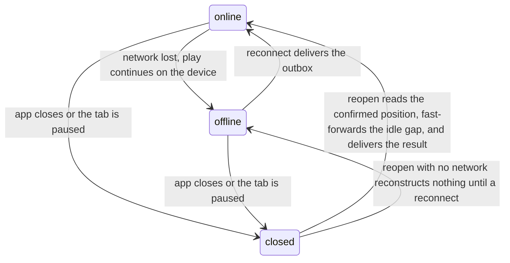

# Offline reconcile

On reconnect the device delivers the progress it made without the server, and the server checks and
settles it in play order. Progress an avatar makes while the server is out of contact lives only on
the device, because the client runs every simulation locally
([game simulation](./game-simulation.md)). Whether the simulation was running while the server was
out of contact decides what the device delivers: real work, or a reconstructed idle gap.
[Replay verification](./replay-verification.md) owns the checks and the settlement, and the
[seed chain](./seed-chain.md) owns the positions each delivered activity claims.

## Three connectivity states

Two independent things describe an avatar's situation: whether the app is open, and whether the
network is reachable. Three states cover every combination, because a closed app makes the network
irrelevant.

| State       | App    | Simulation  | Network      |
| ----------- | ------ | ----------- | ------------ |
| **online**  | open   | running     | reachable    |
| **offline** | open   | running     | unreachable  |
| **closed**  | closed | not running | not relevant |

A backgrounded tab behaves like a closed one: the browser can pause its worker while the app is open
and the network reachable, so the simulation stops and a gap opens.

The network returning is a reconnect, and the app opening is a reopen. Reconnect drives reconcile;
reopen alone does not. A device that reopens while the network is still unreachable enters the
offline state directly, reconstructs no gap, and delivers nothing until it later reconnects.

## Resuming: fast-forward first, then play

When the device resumes, it fast-forwards the gap between its last simulated position and now, then
resumes live play. A fast-forward is a deterministic re-simulation from the last known position over
the elapsed time, run as re-attempts of the node the avatar was last on. A zero-length gap does
nothing. The simulation is local, but the worker reads the server's confirmed position before it
fast-forwards anything, so a fast-forward runs only once the network answers.

The fast-forward runs before live play resumes, or two things go wrong:

- A seed collision. The idle attempts spend chain positions, so the server refuses an activity that
  resumes from the device's stale position at the anchor check
  ([seed chain](./seed-chain.md#handing-an-activity-start-to-the-server)).
- A stale build snapshot. The resumed activity carries a build snapshot without the XP the idle
  attempts earned, so the server rejects it as a mismatch on delivery.

Network availability gates the start of a fast-forward and the delivery of its result, never the
simulation between. The anti-cheat guarantee lives at delivery: the server meters the
[offline budget](./game-simulation.md#the-offline-budget) on the append path, and the fast-forward
settles only up to where the budget runs out.

## Losing offline navigation across sessions

Resuming at full fidelity needs the device's own durable outbox: the pending activity starts and
queued checkpoints that offline play left behind. A same-device reopen has the outbox, and so does a
writer handover within the same browser profile, so the offline traversal is delivered activity by
activity and any idle gap on top of it fast-forwards. A different device or browser profile reads a
different store. It knows only the last position the server confirmed, so it fast-forwards idle
attempts at that node instead, and the device delivers none of the nodes the player walked offline.
The loss is mechanical: while the original device is offline or closed, nothing can reach its
outbox.

An account holds one verified session, so verifying a session on a new device evicts every other
session the account owns ([auth](../services/auth.md#session-lifecycle)). The evicted device's next
server call fails, so the work that session never delivered never reaches the server.

### When a session ends

The outbox outlives the session that filled it, and how that session ended decides what the device
does with it.

| What happened to the session | Its row         | The device's outbox                 |
| ---------------------------- | --------------- | ----------------------------------- |
| Another device took it over  | deleted at once | discarded                           |
| The player signed out here   | deleted at once | discarded, once the player confirms |
| It ran past its expiry       | left in place   | kept                                |

A takeover discards the outbox without asking, because delivering it later would write progress the
player made elsewhere, and the device taking the account over warns the player first. On a sign-out,
the sign-out control decides.

### Signing out

Before it ends the session, the sign-out control asks the worker what the outbox holds. With an
empty outbox, the control signs the player out at once. With a non-empty one, it warns the player,
naming how many activities the outbox holds and how much simulated play the server has not received.
On confirm, the worker discards the outbox and the control ends the session. On cancel, both stay as
they are, and the same account signing back in delivers the outbox. The warning and the discard
cover only the signed-in account's avatars: an activity start naming another avatar survives, and it
delivers once that account signs back in.

## Settlement in order

An activity's rewards are provisional until the verifier confirms it
([replay verification](./replay-verification.md)). Only then does the reward settle: the avatar's XP
total rises, its items mint, and the node's first clear, the one-time grant recorded when its clear
verifies, opens its neighbours. An activity built on an earlier one's reward is provisional in the
same way, so the server settles an avatar's activities one at a time, in the order the player played
them, and checks each only after every earlier one is settled or rejected.

A player clears one node, then walks to its neighbour. The neighbour is built on the first twice:
its build snapshot folds in the XP the first earned, and the neighbour is reachable only because the
first node was cleared. Settling the neighbour before the first node's clear is confirmed would pay
out against a clear the server might still reject, and a paid reward is never clawed back. A
rejected activity takes its XP and its clear with it, so any later activity that leaned on either
fails its own check.

Ordering sequences the checks; it never decides whether an activity is legal. A failed attempt still
settles, so the activities behind it stop waiting. It opens no node, because a settle and a first
clear are distinct outcomes of one activity. The order covers revisits. A player who walks node A,
its neighbour B, back to A, and to B again makes four activities, and the server settles them in
that sequence.

## Where the order comes from

The server cannot recover the play order from its own clocks, because the activities of an offline
stretch arrive together at reconnect. The client declares the order, since it alone witnessed the
play. Each activity names its predecessor: the avatar's immediately-prior activity across every
chain, null only for the avatar's first. The client stamps it at start from a durable per-avatar
record of the last-started activity, which survives a worker reload. An out-of-order or
reload-orphaned delivery only delays a successor until its named predecessor lands; it never points
the server at the wrong activity. Declaring a false order buys nothing, because the checks read only
settled state.

## Held activities

A parked or quarantined activity is neither a settle nor a rejection, and both mark a bug or an
incident. Because settlement is a single order, a held activity stops every later activity of that
avatar from settling until an operator acts: the server never settles progress on a foundation it
cannot verify. A dependency failure is neither a hold nor a verdict: the verifier backs the activity
off ([replay](./replay-verification.md#replay)), and the player sees only a longer "Settling…"
display.

## Worker lifecycle

One writer worker per browser profile owns every activity transition; the tabs express intent and
read the worker's outcome, so no tab drives the activity service itself. The worker is an explicit
state machine that runs one flow at a time, so no two flows install over each other. A resync reads
the server's confirmed state and decides what to fast-forward.

Stopping does not queue behind the active flow: it halts the local simulation at once and needs no
network. The worker then flushes the activity's earned checkpoints and sends an idempotent stop
request, retried at every reconnect until the server confirms it. Until that request lands, the
worker holds back its next resync, so a fast-forward never revives an activity the player stopped.

A server refusal is an answer, so it never marks the device offline. The worker resends a start the
server deferred on a backoff and at once on a reconnect, and the reconnect drain skips a start whose
predecessor is still deferred.
