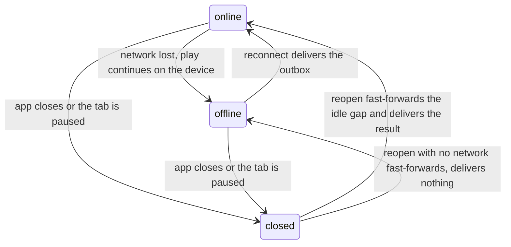

# Offline reconcile

Reconcile delivers, checks, and settles the progress an avatar made without the server, in play
order, once the device reconnects. The client runs every real-time simulation and records it as
append-only checkpoints; the server never simulates on the request path. So progress an avatar makes
while the server is out of contact lives only on the device until it reconnects. Reconcile brings
that progress back: it delivers the activities the device holds, replays them to decide whether to
trust them, and settles their rewards in order. Whether the simulation was running while the server
was out of contact decides which it is: real work to deliver, or an idle gap to reconstruct.

Three connectivity states describe the device, and a reconnect brings offline progress back.

## Three connectivity states

Two independent things describe an avatar's situation: whether the app is open, and whether the
network is reachable. Three named states cover the common cases.

| State       | App    | Simulation  | Network      |
| ----------- | ------ | ----------- | ------------ |
| **online**  | open   | running     | reachable    |
| **offline** | open   | running     | unreachable  |
| **closed**  | closed | not running | not relevant |

While **online**, each checkpoint reaches the server as it is written. While **offline**, the player
keeps playing — the simulation ticks, the avatar clears nodes, and each activity's start and
checkpoints are written durably to the device — but nothing is delivered. While **closed**, nothing
runs, and an idle gap opens that the device reconstructs on the next open.

A backgrounded tab behaves like a closed one. The browser can pause its worker even while the app is
open and the network reachable, so the simulation stops and a gap opens. Reconcile reconstructs that
gap on resume just as it does a closed period's.

The network returning is a **reconnect**, and the app opening is a **reopen**. Reconnect drives
reconcile; reopen alone does not. A device that reopens while the network is still unreachable
enters the offline state directly, without ever passing through online, and delivers nothing until
it later reconnects. So a player crosses several states in one arc — online, into a dead spot
(offline), close the app (closed), reopen hours later — and reconcile handles the whole arc at the
reconnect that eventually follows.

## Resuming: fast-forward first, then play

When the device resumes, it first reconstructs the gap between its last simulated position and now,
then resumes live play. Reconstruction is a **fast-forward**: a deterministic re-simulation from the
last known position over the elapsed time. The fast-forward is local — it needs no network, because
the seed and position it starts from are cached on the device and the simulation is a pure function
of them. Only delivering the result waits for reconnect.

The fast-forward must run before live play resumes, or two things go wrong:

- **A seed collision.** The idle time was really more attempts at the node, and each attempt takes
  the next seed in that node's [seed chain](./seed-chain.md). An activity that resumes from the
  device's last known position takes a seed those idle attempts already took, and a seed chain holds
  one attempt per position, so the server rejects one of the two.
- **A stale build snapshot.** The resumed activity carries a build snapshot without the XP the idle
  attempts earned, so the server rejects it as a mismatch on delivery.

Fast-forwarding first moves the device past those idle attempts, so live play starts from a free
position.

The gap can be any size, including zero. A player who was actively playing has no gap, so the
fast-forward is a no-op and live play continues. A player returning from a long closed period has a
large gap, reconstructed as re-attempts of the node they were last on.

Network availability never gates the local simulation; it gates only delivery. The anti-cheat
guarantee lives at delivery: the server meters the
[offline budget](./game-simulation.md#the-offline-budget) on the append path, and the catch-up
settles only up to where the budget runs out. The activity caps at that point, and the device
resyncs from there. A device could set its own clock forward and fast-forward an enormous gap, and
it would still settle nothing past the budget.

## Losing offline navigation across sessions

Resuming at full fidelity needs the device's own durable outbox — the pending activity starts and
queued checkpoints that offline play left behind. Whether that outbox is present splits resume into
two outcomes.

A **same-device reopen** has the outbox, because device storage persists across a close — and so
does a writer handoff within the same browser profile, when a tab dies and a new worker takes over.
The real offline traversal is delivered activity by activity, and any idle gap on top of it
fast-forwards. Nothing is lost.

**A different device or browser profile** has no access to that outbox, because it reads a different
store. It knows only the last position the server confirmed, before the offline play, so it
fast-forwards a counterfactual idle grind of that confirmed node. The offline navigation — the nodes
the player actually walked — is lost. The gap between the position the device reached and the
position the server confirmed is exactly what is lost.

This loss is mechanical, not a policy choice. While the original device is offline or closed,
nothing can reach its outbox — it sits in that device's own local storage.

An account holds one verified session, so verifying a session on a new device evicts every other
session row the account owns ([auth](../services/auth.md#session-lifecycle)). The evicted device
signs itself out, so no service needs a rule of its own for a caller whose session was taken over.
app-web re-validates the session against the session service on every server call, and the evicted
device's next call finds the row gone. app-web clears the cookie and refuses that call itself, so
the work that session never delivered never reaches the server.

### When a session ends

The outbox outlives the session that filled it. What the device does with the work inside it depends
on how that session ended.

| What happened to the session | Its row         | The device's outbox                 |
| ---------------------------- | --------------- | ----------------------------------- |
| Another device took it over  | deleted at once | discarded                           |
| The player signed out here   | deleted at once | discarded, once the player confirms |
| It ran past its expiry       | left in place   | kept                                |

On a takeover, the worker throws the outbox away. app-web answers the call itself and marks the
answer with a header saying the session was taken over rather than that it ran out. The worker reads
that header and clears its pending activity starts, its queued checkpoints, and the preferences it
would otherwise recover from. A worker that kept that work would deliver it the next time the player
signs in here, long after the player carried on elsewhere. The player is warned before taking the
account over, so nothing is lost silently.

A session that runs past its expiry keeps its row until the next refresh call deletes it and reports
what happened. app-web tells a takeover from a lapsed session by that report, and it sends no header
when a session has run out. So a player whose session lapsed while the app was closed delivers the
offline play the device holds once they sign back in.

A sign-out is the one ending the server cannot signal. One request deletes the session row and
clears this device's cookie together, so no later call finds the row gone and app-web never sends
the takeover header. The browser decides what happens to the outbox instead
([signing out](#signing-out)).

Session eviction and writer ownership are separate mechanisms on separate scopes. The session
belongs to the account, and evicting it signs a device out of everything. The writer belongs to one
activity: that activity's head row stamps the session allowed to append to it, and resuming the
activity on another session takes the stamp over
([game simulation](./game-simulation.md#checkpoint-streams)). An avatar's other activities keep the
writer they already carry.

### Signing out

The sign-out control asks the worker what the outbox holds before it ends the session. An empty
outbox signs the player out with no warning. An outbox holding runs warns the player first, naming
how many runs and how much play it holds, and the worker clears it once the player confirms.
Cancelling leaves the outbox where it is.

Only the outbox counts. A run's play is the span of its still-queued checkpoints, so a partly
delivered run counts its undelivered tail alone. A run the server has received in full has no rows
in the outbox, so it raises no warning, and the next sign-in attaches to it again.

The two worker calls fail opposite ways, because they risk opposite things. A worker that cannot say
what it holds signs the player out and leaves the outbox where it stands: a dead worker must never
trap a player on the settings screen. A discard that fails holds the sign-out back and asks the
player to try again: ending the session with the work still queued is what the warning exists to
prevent. The worker clears its durable stores before it stops the live run, so a failed clear leaves
the run ticking and the outbox intact.

What a cancelled sign-out leaves in the outbox can reach the server only from the account that
played it. A different account signing in on this device cannot deliver it: the worker drains only
the acting avatar's activity starts, and the server refuses a start naming an avatar the acting user
does not own. The same account signing back in delivers it, which is what cancelling asks for.

## Settlement in order

An activity's rewards are provisional until the server [replays](./game-simulation.md#replay) the
activity and confirms it. Only then does the reward settle: the avatar's XP total rises, its items
mint, and a cleared node's neighbours open. An activity built on an earlier one's reward is
provisional in the same way, so the server settles them in the order the player played them.

> The server settles an avatar's activities one at a time, in the order the player played them. It
> checks each only after every earlier one is settled or rejected. A rejected activity takes its XP
> and its clear with it, so any later activity that leaned on either fails its own check.

A player clears one node, then walks to its neighbour. Clearing the first node earns XP and opens
the neighbour. The neighbour is built on the first twice: its build snapshot folds in the XP the
first earned, and its node is reachable only because the first was cleared. Settling the neighbour
before the first node's clear is confirmed would pay out against a clear the server might still
reject, and a paid reward is never clawed back.

Ordering does one thing — it sequences the checks. It never decides whether an activity is legal;
per-activity checks do that. Because every earlier activity is already settled or rejected when a
check runs, the check reads the cleared frontier and the settled XP total, never a pending one.

Reachability is one such check. It confirms the activity's node is adjacent to a node the avatar has
already cleared — the origin node counts as always reachable, so an avatar's first activity passes
with no cleared neighbour. An honest traversal passes: the clear that opened the node settled
earlier in the order, so its grant is present. A jump to a node adjacent to nothing cleared has no
such grant, and the check rejects it.

This is why ordering waits on an earlier activity settling, not clearing. A failed attempt is
settled, so it releases the wait — but it opened no node, so the reachability check still rejects a
later activity that had no cleared neighbour.

The order comes from the client, so the server does not settle on it blindly. Two per-activity
checks are the boundary, and each reads only what the avatar has already settled. The build check
re-derives an activity's expected starting build from the settled XP total and requires its pinned
build to match; a build is a pure function of total XP, so a run that banked XP a later rejection
erased fails it. The reachability check reads the settled first-clear grants, so it too passes only
once the clear that opens a node has settled. Neither check can be fooled by a declared order: each
sees only settled state, whatever order the client sent.

The order covers revisits. A player who walks node A, its neighbour B, back to A, and to B again
makes four activities, and the server settles them in that same sequence — A₁, B₂, A₃, B₄.

## Where the order comes from

The server cannot recover the play order from its own clocks: an activity's real start happened
offline, and the activities arrive together at reconnect in no meaningful order. So the client
declares the order — it alone witnessed the play. Each activity carries a `predecessorActivityId`:
the avatar's immediately-prior activity across every chain, null only for its first-ever activity.
The client stamps it at start from a durable per-avatar record of the avatar's last-started
activity, which survives a worker reload, so the reference the client stamps stays consistent across
one. It stamps `playedAt` beside it, an advisory wall-clock timestamp the claim and the checks never
read — it serves operator and analytics queries only. An out-of-order or reload-orphaned delivery
only delays a successor until its named predecessor lands; it never points the server at the wrong
run.

Declaring a false order buys nothing: the checks read only settled state, so reordering a run ahead
of its true predecessor changes nothing they find.

## What an activity's outcome produces

An activity ends one of a few ways, and the end decides what the activity produces when it settles.

- A **clear** — the encounter completed — settles the run's XP, records the node's one-time
  first-clear grant, and opens the node's neighbours.
- A **failed attempt** — the encounter lost — settles the XP the avatar earned during the fight, but
  records no grant and opens no neighbour, because the node was not cleared.
- A **player stop** or an **offline-budget cap** ends the run partway and settles whatever the
  confirmed part earned, opening nothing.

The failed attempt separates the two consequences. XP and node-unlock are distinct outcomes of one
activity: an activity can settle its XP without ever unlocking a node.

## Held activities

Two outcomes are neither a settle nor a clean rejection, and both mark a bug or an incident:

- **Parked** — the server cannot replay the activity for an operational reason: its sim version is
  unknown or expired, the replay provider is down, or replay timed out. Parking is not a cheat
  verdict; the activity waits for an operator to resolve the cause.
- **Quarantined** — the activity failed to confirm too many times, so the server sets it aside and
  alerts a human rather than retrying forever.

Because settlement is a single order, a held activity stops every later one from settling. The
design accepts that. While an avatar holds a parked or quarantined activity, its progression is
paused, it cannot start new activities, and the hold alarms operators at once. The response is loud
and blunt on purpose: the server never settles progress on a foundation it cannot verify.

## The essential journeys

Each row is a player journey the design must handle. The state column names which connectivity state
opened the gap.

| Journey                                                    | State          |
| ---------------------------------------------------------- | -------------- |
| Clear a node online                                        | online         |
| Idle a node while closed, then reopen                      | closed         |
| Clear a node offline, then reconnect                       | offline        |
| Clear a node then its neighbour, offline                   | offline        |
| Clear a chain of nodes offline                             | offline        |
| Revisit a node offline                                     | offline        |
| Failed node attempt                                        | offline/closed |
| Jump to an unreachable node                                | offline        |
| Predecessor activity is rejected                           | any            |
| Predecessor activity is held                               | any            |
| The offline budget runs out before the gap is caught up    | closed         |
| A later activity reaches the server before its predecessor | offline        |
| One session moves through online, offline, and closed      | all            |

The reachability check refuses a jump to an unreachable node. A device could widen its own reachable
set offline and start an activity at a node it never earned, but that node is adjacent to nothing
the avatar has cleared, so the check finds no grant and rejects it.

## Worker lifecycle

One [writer worker](./game-simulation.md#writer-election) per browser profile owns every activity
transition; the tabs express intent and read the worker's outcome, so no tab drives the activity
service itself. The worker moves through a small set of states, and its flows — a start, a resync, a
continuation, and an eviction settlement — run strictly one at a time: the lifecycle owner is an
explicit state machine that processes one flow at a time, so two flows never install over each
other.

| State          | Meaning                                                                    |
| -------------- | -------------------------------------------------------------------------- |
| **idle**       | no activity attached; the worker holds an empty simulation                 |
| **starting**   | building or attaching an activity and installing it as the live simulation |
| **running**    | ticking the live simulation and submitting its checkpoints                 |
| **resyncing**  | fetching confirmed server state and deciding what to catch up              |
| **continuing** | delivering an offline traversal or reconstructing a closed-period gap      |
| **evicting**   | clearing a run another session took the writer for                         |
| **stopping**   | ending the running activity and delivering the durable stop request        |

The player can stop the running activity. Unlike a start or a resync, stopping does not queue behind
the active flow — it halts the local simulation at once and needs no network. The client then tells
the server durably: it flushes the activity's earned checkpoints, then sends an idempotent request
to stop the activity, retried at every reconnect until the server confirms it stopped. Until that
request lands, the client holds back its next resync, so a catch-up never revives an activity the
player already stopped.

## Glossary

| Term             | Meaning                                                                                                                                    |
| ---------------- | ------------------------------------------------------------------------------------------------------------------------------------------ |
| activity         | See [game simulation](./game-simulation.md#glossary).                                                                                      |
| node             | A place on the avatar's map, and the target one activity is an attempt at.                                                                 |
| encounter        | The fight an activity runs at its node; completing it clears the node.                                                                     |
| activity start   | See [game simulation](./game-simulation.md#glossary).                                                                                      |
| predecessor      | The avatar's immediately-prior activity across every chain, stamped by the device at start; the verifier waits for it before adjudicating. |
| settle           | The server's verified application of an activity's rewards; the moment provisional becomes real.                                           |
| first clear      | The one-time grant recorded when a node's clear verifies; it opens the node's neighbours.                                                  |
| cleared frontier | See [world map](./worldmap.md#glossary).                                                                                                   |
| fast-forward     | Reconstruct a gap by deterministically re-simulating the elapsed time from the last known position.                                        |
| seed chain       | See [seed chain](./seed-chain.md#glossary).                                                                                                |
