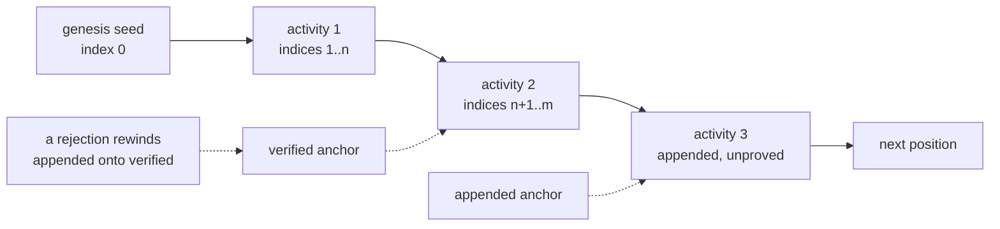

# The seed chain

Every activity an avatar runs at a node draws its randomness from one place: that node's seed chain.
The chain is a single sequence of chain positions running forward. An activity draws the position at
the front, plays out from it, and leaves the next position for the activity that follows. A position
is spent once and never drawn twice, so a failed activity costs a position exactly as a completed
one does. Playing a node again never re-rolls the last result; it plays the next stretch of the
chain.

The chain carries two anchors. The appended anchor marks how far the player claims to have played.
The verified anchor marks how far the server has proved. Play runs ahead of proof, and payment waits
for proof.

A chain belongs to one avatar at one chain scope, a stable place the avatar leaves and returns to. A
world-map encounter's scope is its map node. Two avatars on the same node hold two separate chains.

[Game simulation](./game-simulation.md) owns the activity start the chain feeds and the checkpoint
stream that records each draw. [Replay verification](./replay-verification.md) owns the verifier
that proves a stream and settles it. [Offline reconcile](./offline-reconcile.md#settlement-in-order)
owns the order the server settles an avatar's activities in.
[Game entropy](./game-entropy.md#the-seed-chain) says why the chain is one flat sequence rather than
a tree a player could search.

## Where a chain starts

A node's chain begins at a genesis seed the server mints the first time it reveals the node to the
avatar. The server draws the seed from a cryptographically secure generator, stores it, and never
recomputes it: the verifier reads the stored value, and a restored device fetches it. The server
mints a seed only for a node inside the avatar's revealed region
([what a player may see](./worldmap.md#what-a-player-may-see)); a node outside it gets no chain.
Revealing the same node twice mints nothing new.

## Positions on the chain

A chain position is a seed and a chain index. The seed is a xoroshiro128+ generator state. An
activity's opening seed is the seed the previous activity left at its last position, copied rather
than computed. The verifier never trusts a submitted seed: it reproduces the position from the chain
and compares.

The chain index counts checkpoints along the whole chain rather than within one activity. It never
resets, so a failed activity's indices are spent and gone. Each activity records the index it
started from. A checkpoint's chain index is that start index plus the checkpoint's position in the
activity's stream, so an activity's first checkpoint sits one past where the activity began. Reward
coordinates key on the chain index, so a replay that reproduces the index reproduces the reward, and
the server checks every submitted checkpoint's index against the value it derives for that position.

## Drawing a position

The client draws its position without asking the server. Node reveal hands the device the node's
genesis seed and its current appended anchor
([authoring an activity start](./game-simulation.md#authoring-an-activity-start)). An activity
begins at the node's appended anchor rather than at genesis, so it resumes where play on the node
left off; a node never played has an anchor of its genesis seed at index 0. A device that plays
forward begins its next activity at the position it reached. That position can sit ahead of the
appended anchor the server holds, because the server's appended anchor waits for the activity to
end.

### Handing an activity start to the server

The worker hands each activity start to the server on the next contact, and the server checks the
anchor exactly. A start's index must equal the chain's appended index, and its seed must equal the
chain's appended seed. The server refuses a start computed against a position the chain has since
moved past, rather than layering it onto a position that no longer exists.

The device keeps a start whose refusal a later server state can clear, such as a stale anchor, and
drops a start the server would refuse under any order, such as a chain that was never revealed. It
tells the two apart by the refusal's error code and the reason the refusal carries
([error handling](../services/error-handling.md)). One exception: for a build-snapshot mismatch the
device asks the server for the avatar's latest activity and keeps the start only while an
undelivered predecessor explains the mismatch. A kept start resends on the worker's backoff
([worker lifecycle](./offline-reconcile.md#worker-lifecycle)), and a dropped start takes its queued
checkpoints with it.

## The anchors

The appended anchor moves when an activity forward-exits, leaving active play with honest progress
behind it. The anchor moves to the activity's last appended checkpoint, and only while it still
holds the index the activity started from, so a duplicate transition writes nothing. An activity
that appended nothing, or whose only checkpoint is the `Started` one, moves nothing, because the
`Started` checkpoint draws nothing from the seed.

The verified anchor moves only when a proved activity ends. A segment part way through an activity
settles what it proved and advances that activity's own verified head, but leaves the chain's anchor
where it stands. The anchor moves on the segment that both ends a forward-exited activity and
reaches its last appended checkpoint. When the verifier claims an activity whose start index sits
ahead of the anchor, it catches the anchor up from the forward-exited predecessor before it
adjudicates.

Settlement trusts a position only at or below the verified anchor
([applying verified progress](./replay-verification.md#applying-verified-progress)).

The chain also carries a replay priority. The verifier picks between avatars by the priority on
their chains, highest first and older chain on a tie, and it never reorders one avatar's own chains
against each other.

Whoever moves an anchor, the request path or the verifier, takes the chain row before the activity
row, so the two writers never deadlock.

## Pulling the appended anchor back

The verifier rejects a stream whose divergence it can reproduce, in one transaction:

- It marks the diverging activity rejected, whether it was still active or had already
  forward-exited.
- It rewinds the appended anchor onto the verified anchor in one guarded update.
- It rejects every activity on the chain that started past the verified anchor, active and
  already-exited alike.

Rejecting a stream voids the chain's unproved remainder and reverses no payout already made. Neither
a quarantine nor a writer handover moves an anchor.
