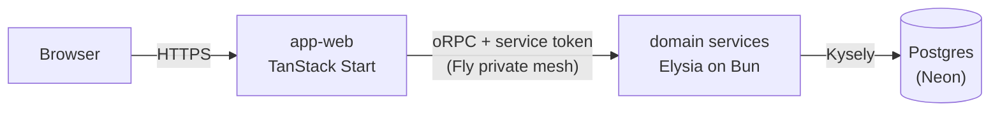

# Overview

Vers is a browser idle game on a microservice backend: a deterministic simulation runs on the
client, the server verifies its results by replay (in build), and everything
[deploys](./deployment.md) from one repo as a single atomic release.

## Request path

The web app is the only public-facing deployment. Its TanStack Start server renders the UI and is
the trust edge: it terminates the user's session, mints a short-lived signed service token carrying
the acting user's ID, and calls domain services through typed oRPC contract clients over Fly's
private mesh. Services verify that token on every call, do their work against Postgres on Neon, and
return typed results.

A user has at most one verified session at a time: completing a 2FA-gated login evicts every other
session on the account, server-side. Because a request's minted service token can outlive its
session by up to the token's own short lifetime, the trust edge also re-confirms the session still
exists on every request before trusting it, so an evicted device is signed out on its next request
rather than waiting for its cached token to expire.

The oRPC link is isomorphic: during SSR the Start server calls services directly; in the browser,
calls go through the app's `/api/rpc` proxy route, since services are not reachable from the public
internet. Either way the client is typed by the service's contract package alone — see
[service contracts](./service-contracts.md).

## Topology

Each service is its own Fly deployment, scale-to-zero, reachable only on the private mesh:

- `service-user`, `service-session`, `service-verification` — the identity platform: accounts,
  sessions (RS256 JWTs signed by the session service), and the OTP/TOTP verification flows. The auth
  design is specified in [auth](./auth.md).
- `service-avatar` — the game-domain service: avatars and their progression.
- `service-email` — queues and delivers transactional email through Resend. Each procedure enqueues
  a pg-boss job and nudges an immediate drain attempt; an hourly scheduled machine sweeps the queue
  for anything that nudge missed, and a failed delivery retries on a backoff before dead-lettering.
- `service-activity` — owns the game's event store: activity streams of simulation checkpoint
  batches, and the "current activity" / "latest progress" reads the client resumes from.
- `service-replay` (in build) — queue-fed checkpoint-replay worker. Replaying a simulation is
  CPU-bound, so replay runs off the request path with its own scaling profile.

## Data

One database, two shapes. Both live in the same Postgres on Neon, which scales to zero when nobody
is playing. Provisioning, connection rules, and where the secrets live: [database](./database.md).

- **Relational identity data** — users, sessions, verifications, avatars — accessed through Kysely,
  migrated by kysely-ctl in `@vers/db`.
- **Activity checkpoints** — an append-only table keyed by `(activity_id, version)`, one row per
  checkpoint batch, alongside a per-activity head row carrying the appended and verified cursors.
  The workload is append-heavy submissions, point reads for "latest progress" off the head row, and
  full-stream replays by the verifier — a natural fit for indexed Postgres, with the head row's
  compare-and-swap backing the checkpoint hash chain. The table carries no inbound foreign keys and
  no global uniqueness constraint, so time-range partitioning with a retention window that
  cold-archives verified streams to object storage is a storage change, not a schema change.
- **Seed chain state** — one `activity_chains` row per `(avatar_id, scope_type, scope_id)` chain
  scope, holding the chain's genesis seed and its appended and verified anchors, from which each
  activity at the scope draws its seed. See [the seed chain](./seed-chain.md).

## Game layer

The simulation is deterministic: a seeded tick engine (`@vers/idle-core`) runs combat in a
SharedWorker on the client (`@vers/idle-client`, cross-tab, fixed-timestep), emitting a stream of
hash-chained checkpoints. Encounter derivation is a pure function of node seed and difficulty living
in the shared libs — not a service — so client and verifier compute identical encounters from the
same inputs.

Checkpoint batches are submitted to the activities service; the verifier replays the same seeds
server-side and compares results before progress is trusted (in build). Checkpoint hashes chain the
stream together but don't attest combat outcomes — replay is the proof. The same replay path
generates offline progress: simulate forward from the last verified checkpoint.

The world map (`@vers/worldmap-*`) generates the world graph — concentric difficulty rings of baked
nodes — and renders it with three.js via react-three-fiber. How the 3D world and the HTML UI share
the screen: [game rendering](./game-rendering.md).

## Cross-cutting

- **Service-to-service auth** — services trust no caller, private mesh included. Every request
  carries a short-lived signed service token minted at the edge with the acting user's ID; the
  runtime plugin in `@vers/service-runtime` verifies it before any handler runs.
- **Contracts** — each service's API is declared in its own `@vers/contract-*` package, oRPC
  contract-first with Zod schemas owned by the contract that declares them. Mechanics, error
  taxonomy, and change discipline: [service contracts](./service-contracts.md).
- **Atomic release** — contracts are unversioned workspace source packages; the repo deploys as one
  unit from one SHA. Turborepo re-typechecks every consumer on any contract change, so divergence
  cannot land on `main`. There is no version matrix — the monorepo is the compatibility mechanism.
- **Observability** — OpenTelemetry (traces and logs to Axiom) and the Sentry SDK (errors to
  Bugsink) are wired into every service by `@vers/service-runtime`; request IDs propagate edge to
  service.

## Core technology

Frontend:

- UI - [React](https://react.dev) 19 with the
  [React Compiler](https://react.dev/learn/react-compiler)
- Framework - [TanStack Start](https://tanstack.com/start) (SSR + server functions)
- Data Fetching - [TanStack Query](https://tanstack.com/query)
- State Management - [Zustand](https://zustand-demo.pmnd.rs)
- 3D Graphics - [Three.js](https://threejs.org), [@react-three/fiber](https://r3f.docs.pmnd.rs)
- Component Library - [Ark UI](https://ark-ui.com)
- Styling - [Panda CSS](https://panda-css.com)

Backend:

- Runtime - [Bun](https://bun.sh)
- Web Server - [Elysia](https://elysiajs.com)
- API Layer - [oRPC](https://orpc.unnoq.com), contract-first
- Database - [PostgreSQL](https://postgresql.org) on [Neon](https://neon.tech) via
  [Kysely](https://kysely.dev)
- Authentication - [TOTP](https://github.com/epicweb-dev/totp),
  [jose](https://github.com/panva/jose), `Bun.password` (argon2id)
- Email - [React Email](https://react.email), [Resend](https://resend.com)

Development:

- Build - [Vite](https://vitejs.dev), [esbuild](https://esbuild.github.io)
- Testing - [Bun's test runner](https://bun.sh/docs/cli/test), [Playwright](https://playwright.dev),
  [MSW](https://mswjs.io)
- Monorepo - [Turborepo](https://turborepo.dev) + [Bun](https://bun.sh) workspaces
- Type Safety - [TypeScript](https://typescriptlang.org), [Zod](https://zod.dev)
- Monitoring - [Bugsink](https://www.bugsink.com) (errors, Sentry protocol),
  [Axiom](https://axiom.co) (traces and logs via [OpenTelemetry](https://opentelemetry.io))
- Analytics - [Umami](https://umami.is) (self-hosted web traffic and acquisition-funnel analytics),
  [Tinybird](https://tinybird.co) (managed ClickHouse behind the product-event stream)
- Hosting - [Fly.io](https://fly.io) (compute), [Neon](https://neon.tech) (data)

## Projects

Applications (`apps/`):

- `apps/bugsink` - self-hosted error tracker, ingesting over the Sentry protocol
- `apps/umami` - self-hosted web analytics, tracked through the web app's same-origin proxy
- `apps/web` - TanStack Start web app; the trust edge and only public deployment
- `apps/web-e2e` - e2e test suite for the web app

Services (`services/`):

- `services/activity` - activities domain service
- `services/avatar` - avatar domain service
- `services/email` - transactional email delivery service, queued on pg-boss
- `services/keys` - avatar roll-key custody and derivation service
- `services/replay` - replay domain service: replays simulation segments to verify submitted
  checkpoints
- `services/session` - session domain service
- `services/user` - user domain service
- `services/verification` - OTP/TOTP verification domain service

Contracts (`contracts/`):

- `contracts/activity` - oRPC API declaration for the activities service
- `contracts/avatar` - oRPC API declaration for the avatar service
- `contracts/base` - shared contract error taxonomy and base builders
- `contracts/email` - oRPC API declaration for the email service
- `contracts/keys` - oRPC API declaration for the keys service
- `contracts/replay` - oRPC API declaration for the replay service
- `contracts/session` - oRPC API declaration for the session service
- `contracts/user` - oRPC API declaration for the user service
- `contracts/verification` - oRPC API declaration for the verification service

Libraries (`libs/`, grouped by domain):

- `libs/core/email` - Resend wrapper and react-email template factories
- `libs/core/flags` - OpenFeature-backed feature flag registry and env provider
- `libs/core/trace` - isomorphic W3C trace-context primitives (mint, serialize, parse)
- `libs/core/utils` - low-level platform-agnostic utils
- `libs/data/data` - core static game data
- `libs/data/db` - kysely connection helper, migrations, and generated database types
- `libs/design/design-system` - ui component library (Ark UI primitives + Panda recipes)
- `libs/design/panda-preset` - design tokens & panda css config
- `libs/design/styled-system` - generated code for panda css design system
- `libs/game/worldmap-client` - client code (react, three, zustand) for the world map
- `libs/game/worldmap-core` - platform-agnostic world-graph generation
- `libs/game/game-rendering` - client rendering shell: scene/presentation state for the persistent
  three.js canvas
- `libs/game/game-utils` - shared game logic (encounter derivation, rewards)
- `libs/game/roll-crypto` - avatar roll-key derivation and the rolled-reward digest PRF
- `libs/game/item-gen` - entropy-agnostic item interpreter: roll streams, versioned loot tables,
  affix constraints
- `libs/game/idle-client` - client code (react, zustand, SharedWorker) for the idle simulation
- `libs/game/idle-core` - deterministic seeded simulation engine
- `libs/service/jobs` - typed pg-boss job queue wrapper: send, drain, and retry/dead-letter policy
- `libs/service/product-analytics` - product-event registry types and the Tinybird Events API sender
- `libs/service/service-auth` - s2s token minting, parsing, and audience derivation
- `libs/service/service-runtime` - Elysia service runtime: createService, s2s auth, health, logging,
  OTel/Sentry wiring
- `libs/service/service-utils` - shared Elysia middleware (auth, logging, remote address) and
  service env schemas
- `libs/testing/client-test-utils` - react & web worker testing utilities
- `libs/testing/mock-services` - MSW mock backends for the service contracts: @msw/data-backed
  routers, per-test override proxies, and the demo seed
- `libs/testing/service-test-utils` - postgres test container & mock data utils
- `libs/testing/test-utils` - generic test helpers: env override/cleanup, MSW lifecycle wiring, JWT
  and in-process RPC-client fixtures, and oRPC conformance-case collection

Infrastructure:

- `infra` - pulumi infrastructure definitions and the Tinybird workspace datafiles
  (`infra/tinybird`)
