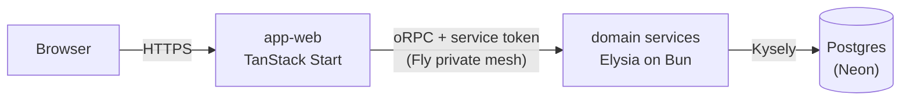

# Overview

Vers is a browser idle game on a microservice backend. A deterministic simulation runs on the
client, the server verifies its results by replay, and the whole repo
[deploys](./platform/deployment.md) as one release built from a single SHA. Each section below names
one subsystem, states the distinction that orients it, and links to the doc that owns its detail.

## Request path

The web app (`apps/web`) is the only public-facing deployment. Its TanStack Start server renders the
UI and is the trust edge. It terminates the user's session, mints a short-lived signed service token
carrying the acting user's ID, and calls domain services through typed oRPC contract clients over
Fly's private mesh. Services verify that token on every call, do their work against Postgres on
Neon, and return typed results.

The oRPC link is isomorphic: during SSR the Start server calls services directly, and in the browser
calls route through the app's `/api/rpc` proxy since services are not reachable from the public
internet. Either way the client is typed by the service's contract package alone
([service contracts](./services/service-contracts.md)).

A user has at most one verified session at a time, so completing a 2FA-gated login evicts every
other session on the account server-side ([auth](./services/auth.md)). A minted service token can
outlive its session by up to its own short lifetime, so the trust edge re-confirms the session still
exists on every request before trusting the token. An evicted device is therefore signed out on its
next request rather than when its cached token expires.

## Topology

Each domain service is its own Fly deployment, reachable only on the private mesh, and scales to
zero when idle ([deployment](./platform/deployment.md)). The replay service runs off the request
path: it carries no player traffic, and the activity service wakes it with a service call each time
an append leaves unverified work. Older engine builds stay replayable through per-version replay
provider apps that the deploy CLI provisions
([sim-version registry](./game/replay-verification.md#sim-version-registry)).

## Data

The shared Neon database holds three shapes of game data, and it scales to zero when nobody is
playing ([database](./platform/database.md)). Every application table is accessed through Kysely and
migrated by kysely-ctl in `@vers/db`. One exception: pg-boss owns the `pgboss` schema and migrates
it itself ([queues](./platform/queues.md)).

- **Relational identity data** — users, sessions, verifications, and avatars.
- **The activity checkpoint tables** — an append-only checkpoint log plus a per-activity head row
  that carries the simulation's progress and the cursors its verification advances
  ([checkpoint streams](./game/game-simulation.md#checkpoint-streams)).
- **Seed chain state** — one row per `(avatar, chain scope)` pair, which hands each activity at a
  scope the seed it draws from ([the seed chain](./game/seed-chain.md)).

## Game layer

The simulation is deterministic. A seeded tick engine (`@vers/idle-core`) runs combat in a
SharedWorker on the client and emits a stream of hash-chained checkpoints
([game simulation](./game/game-simulation.md)). Encounter derivation is a pure function of node seed
and difficulty that lives in shared libraries rather than a service, so the client and the verifier
compute identical encounters from the same inputs.

The server trusts progress only through replay. The client submits checkpoint batches to the
activities service, and the verifier replays the same seeds server-side and compares results before
progress settles ([game simulation](./game/game-simulation.md)). The checkpoint hashes chain the
stream together but do not attest combat outcomes. Replay is the proof, and the same replay path
generates offline progress by simulating forward from the last verified checkpoint.

The world map (`@vers/worldmap-*`) gives every avatar a distinct, unbounded graph generated on
demand: the client derives its geometry locally from a deterministic hex lattice while the server
seals each node's content behind a per-avatar secret, so map shape reveals nothing about reward
([world map](./game/worldmap.md)). The client renders that graph with three.js through
react-three-fiber ([game rendering](./game/game-rendering.md)).

## Cross-cutting

- **Service-to-service (s2s) auth** — services trust no caller, the private mesh included. Every
  request carries a short-lived signed s2s token from a registered issuer: the edge mints it for a
  browser-originated call, and a calling service mints it for a service-originated one, with the
  acting user's ID when the call has one. The service runtime (`@vers/service-runtime`) verifies it
  before any handler runs ([auth](./services/auth.md)).
- **Contracts** — each service declares its API in its own `@vers/contract-*` package, oRPC
  contract-first with Zod schemas owned by the declaring contract
  ([service contracts](./services/service-contracts.md)).
- **Single-SHA release** — contracts are unversioned workspace source packages, and the repo deploys
  as one unit from one SHA ([deployment](./platform/deployment.md)).
  [Service contracts](./services/service-contracts.md#change-discipline) owns the change discipline
  that keeps consumers and services in step.
- **Observability** — OpenTelemetry sends traces, logs, and metrics to Axiom; the Sentry SDK sends
  errors to Bugsink. The service runtime wires both into every service, and one trace id follows a
  request from edge to service ([observability](./platform/observability.md)).
- **Manual QA** — a QA pass drives production at `https://versidle.com` with an account under
  `qa.versidle.com`, a debug Chrome, and the `bun run qa:*` scripts that seed accounts, read
  verification email, log worker traffic, and send the fleet cold ([manual QA](../runbooks/qa.md)).

## Core technology

Frontend:

- UI - [React](https://react.dev) 19 with the
  [React Compiler](https://react.dev/learn/react-compiler)
- Framework - [TanStack Start](https://tanstack.com/start) (SSR + server functions)
- Data Fetching - [TanStack Query](https://tanstack.com/query)
- State Management - [Zustand](https://zustand-demo.pmnd.rs)
- 3D Graphics - [Three.js](https://threejs.org), [@react-three/fiber](https://r3f.docs.pmnd.rs)
- Component Library - [Ark UI](https://ark-ui.com)
- Styling - [Panda CSS](https://panda-css.com)

Backend:

- Runtime - [Bun](https://bun.sh)
- Web Server - [Elysia](https://elysiajs.com)
- API Layer - [oRPC](https://orpc.unnoq.com), contract-first
- Database - [PostgreSQL](https://postgresql.org) on [Neon](https://neon.tech) via
  [Kysely](https://kysely.dev)
- Authentication - [TOTP](https://github.com/epicweb-dev/totp),
  [jose](https://github.com/panva/jose), `Bun.password` (argon2id)
- Email - [React Email](https://react.email), [Resend](https://resend.com)

Development:

- Build - [Vite](https://vitejs.dev)
- Testing - [Bun's test runner](https://bun.sh/docs/cli/test), [Playwright](https://playwright.dev),
  [MSW](https://mswjs.io)
- Monorepo - [Turborepo](https://turborepo.dev) + [Bun](https://bun.sh) workspaces
- Type Safety - [TypeScript](https://typescriptlang.org), [Zod](https://zod.dev)
- Monitoring - [Bugsink](https://www.bugsink.com) (errors, Sentry protocol),
  [Axiom](https://axiom.co) (traces and logs via [OpenTelemetry](https://opentelemetry.io))
- Analytics - [Umami](https://umami.is) (self-hosted web traffic and acquisition-funnel analytics),
  [Tinybird](https://tinybird.co) (managed ClickHouse behind the product-event stream)
- Hosting - [Fly.io](https://fly.io) (compute), [Neon](https://neon.tech) (data)

## Projects

The workspace globs and the naming rule in AGENTS.md derive the project list: `apps/*` holds the web
app, its e2e suite, and the two self-hosted tools; `services/*` holds one domain service per bounded
context; `contracts/*` holds one oRPC contract package per service plus the shared base;
`libs/<domain>/*` groups the libraries as core, data, design, game, service, and testing; and
`infra` and `scripts` hold the Pulumi program and the operational CLIs. Three members differ from
their sets. `libs/testing/qa-account` is `server-only`, because it runs the sealed encounter
derivation. `libs/design/styled-system` is generated output. `libs/game/content-version` is shared
by the deploy CLI and the engine packages, so a content version bump is one edit.
