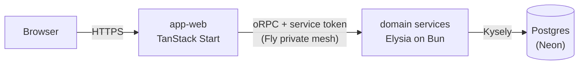

# Overview

Vers is a browser idle game on a microservice backend. A deterministic simulation runs on the
client, the server verifies its results by replay, and the whole repo
[deploys](./platform/deployment.md) as one atomic release from a single SHA. This document is the
system map: it names each subsystem, states the one distinction that orients a reader, and links to
the doc that owns each part's detail. Read it to place a change or a question in the right
subsystem, then follow the link to that subsystem's own doc.

## Request path

The web app (`apps/web`) is the only public-facing deployment. Its TanStack Start server renders the
UI and is the trust edge. It terminates the user's session, mints a short-lived signed service token
carrying the acting user's ID, and calls domain services through typed oRPC contract clients over
Fly's private mesh. Services verify that token on every call, do their work against Postgres on
Neon, and return typed results.

The oRPC link is isomorphic: during SSR the Start server calls services directly, and in the browser
calls route through the app's `/api/rpc` proxy since services are not reachable from the public
internet. Either way the client is typed by the service's contract package alone
([service contracts](./services/service-contracts.md)).

A user has at most one verified session at a time, so completing a 2FA-gated login evicts every
other session on the account server-side ([auth](./services/auth.md)). A minted service token can
outlive its session by up to its own short lifetime, so the trust edge re-confirms the session still
exists on every request before trusting the token. An evicted device is then signed out on its next
request rather than when its cached token expires.

## Topology

Each domain service is its own Fly deployment, reachable only on the private mesh, and scales to
zero when idle ([deployment](./platform/deployment.md)). The replay worker is the exception:
replaying a simulation is CPU-bound, so it runs off the request path with its own scaling profile
and keeps a warm machine.

## Data

One Postgres database on Neon holds two shapes of data, and it scales to zero when nobody is playing
([database](./platform/database.md)).

- **Relational identity data** — users, sessions, verifications, and avatars — is accessed through
  Kysely and migrated by kysely-ctl in `@vers/db`.
- **Activity checkpoints** — an append-only log plus a per-activity head row — carry the
  simulation's progress and the cursors its verification advances
  ([database](./platform/database.md)).
- **Seed chain state** — one row per `(avatar, chain scope)` pair — hands each activity at a scope
  the seed it draws from ([the seed chain](./game/seed-chain.md)).

## Game layer

The simulation is deterministic. A seeded tick engine (`@vers/idle-core`) runs combat in a
SharedWorker on the client and emits a stream of hash-chained checkpoints
([game simulation](./game/game-simulation.md)). Encounter derivation is a pure function of node seed
and difficulty that lives in shared libraries rather than a service, so the client and the verifier
compute identical encounters from the same inputs.

The server trusts progress only through replay. The client submits checkpoint batches to the
activities service, and the verifier replays the same seeds server-side and compares results before
progress settles ([game simulation](./game/game-simulation.md)). The checkpoint hashes chain the
stream together but do not attest combat outcomes. Replay is the proof, and the same replay path
generates offline progress by simulating forward from the last verified checkpoint.

The world map (`@vers/worldmap-*`) generates the world graph as concentric difficulty rings of baked
nodes. It renders that graph with three.js through react-three-fiber
([game rendering](./game/game-rendering.md)).

## Cross-cutting

- **Service-to-service auth** — services trust no caller, the private mesh included. Every request
  carries a short-lived signed service token minted at the edge with the acting user's ID, and the
  runtime plugin in `@vers/service-runtime` verifies it before any handler runs
  ([auth](./services/auth.md)).
- **Contracts** — each service's API is declared in its own `@vers/contract-*` package, oRPC
  contract-first with Zod schemas owned by the declaring contract
  ([service contracts](./services/service-contracts.md)).
- **Atomic release** — contracts are unversioned workspace source packages, and the repo deploys as
  one unit from one SHA. Turborepo re-typechecks every consumer on any contract change, so
  divergence cannot land on `main`. There is no version matrix; the monorepo is the compatibility
  mechanism ([deployment](./platform/deployment.md)).
- **Observability** — OpenTelemetry sends traces and logs to Axiom; the Sentry SDK sends errors to
  Bugsink. Both are wired into every service by `@vers/service-runtime`, and request IDs propagate
  from edge to service ([observability](./platform/observability.md)).

## Core technology

Frontend:

- UI - [React](https://react.dev) 19 with the
  [React Compiler](https://react.dev/learn/react-compiler)
- Framework - [TanStack Start](https://tanstack.com/start) (SSR + server functions)
- Data Fetching - [TanStack Query](https://tanstack.com/query)
- State Management - [Zustand](https://zustand-demo.pmnd.rs)
- 3D Graphics - [Three.js](https://threejs.org), [@react-three/fiber](https://r3f.docs.pmnd.rs)
- Component Library - [Ark UI](https://ark-ui.com)
- Styling - [Panda CSS](https://panda-css.com)

Backend:

- Runtime - [Bun](https://bun.sh)
- Web Server - [Elysia](https://elysiajs.com)
- API Layer - [oRPC](https://orpc.unnoq.com), contract-first
- Database - [PostgreSQL](https://postgresql.org) on [Neon](https://neon.tech) via
  [Kysely](https://kysely.dev)
- Authentication - [TOTP](https://github.com/epicweb-dev/totp),
  [jose](https://github.com/panva/jose), `Bun.password` (argon2id)
- Email - [React Email](https://react.email), [Resend](https://resend.com)

Development:

- Build - [Vite](https://vitejs.dev), [esbuild](https://esbuild.github.io)
- Testing - [Bun's test runner](https://bun.sh/docs/cli/test), [Playwright](https://playwright.dev),
  [MSW](https://mswjs.io)
- Monorepo - [Turborepo](https://turborepo.dev) + [Bun](https://bun.sh) workspaces
- Type Safety - [TypeScript](https://typescriptlang.org), [Zod](https://zod.dev)
- Monitoring - [Bugsink](https://www.bugsink.com) (errors, Sentry protocol),
  [Axiom](https://axiom.co) (traces and logs via [OpenTelemetry](https://opentelemetry.io))
- Analytics - [Umami](https://umami.is) (self-hosted web traffic and acquisition-funnel analytics),
  [Tinybird](https://tinybird.co) (managed ClickHouse behind the product-event stream)
- Hosting - [Fly.io](https://fly.io) (compute), [Neon](https://neon.tech) (data)

## Projects

Applications (`apps/`):

- `apps/bugsink` - self-hosted error tracker, ingesting over the Sentry protocol
- `apps/umami` - self-hosted web analytics, tracked through the web app's same-origin proxy
- `apps/web` - TanStack Start web app; the trust edge and only public deployment
- `apps/web-e2e` - e2e test suite for the web app

Services (`services/`):

- `services/activity` - activities domain service
- `services/avatar` - avatar domain service
- `services/email` - transactional email delivery service, queued on pg-boss
- `services/keys` - avatar roll-key custody and derivation service
- `services/replay` - replay domain service: replays simulation segments to verify submitted
  checkpoints
- `services/session` - session domain service
- `services/user` - user domain service
- `services/verification` - OTP/TOTP verification domain service

Contracts (`contracts/`):

- `contracts/activity` - oRPC API declaration for the activities service
- `contracts/avatar` - oRPC API declaration for the avatar service
- `contracts/base` - shared contract error taxonomy and base builders
- `contracts/email` - oRPC API declaration for the email service
- `contracts/keys` - oRPC API declaration for the keys service
- `contracts/replay` - oRPC API declaration for the replay service
- `contracts/session` - oRPC API declaration for the session service
- `contracts/user` - oRPC API declaration for the user service
- `contracts/verification` - oRPC API declaration for the verification service

Libraries (`libs/`, grouped by domain):

- `libs/core/email` - Resend wrapper and react-email template factories
- `libs/core/flags` - OpenFeature-backed feature flag registry and env provider
- `libs/core/trace` - isomorphic W3C trace-context primitives (mint, serialize, parse)
- `libs/core/utils` - low-level platform-agnostic utils
- `libs/data/data` - core static game data
- `libs/data/db` - kysely connection helper, migrations, and generated database types
- `libs/data/release-registry` - deploy release registry: records a row per rollout that passed its
  post-deploy probes and finds each app's newest release as its rollback target
- `libs/data/sim-registry` - sim-engine version registry: registers built engine images, resolves
  versions by engine hash, and expires rows past their retention deadline
- `libs/design/design-system` - ui component library (Ark UI primitives + Panda recipes)
- `libs/design/panda-preset` - design tokens & panda css config
- `libs/design/styled-system` - generated code for panda css design system
- `libs/game/worldmap-client` - client code (react, three, zustand) for the world map
- `libs/game/worldmap-core` - platform-agnostic world-graph generation
- `libs/game/game-rendering` - client rendering shell: scene/presentation state for the persistent
  three.js canvas
- `libs/game/game-utils` - shared game logic (encounter derivation, rewards)
- `libs/game/roll-crypto` - avatar roll-key derivation and the rolled-reward digest PRF
- `libs/game/item-gen` - entropy-agnostic item interpreter: roll streams, versioned loot tables,
  affix constraints
- `libs/game/idle-client` - client code (react, zustand, SharedWorker) for the idle simulation
- `libs/game/idle-core` - deterministic seeded simulation engine
- `libs/service/jobs` - typed pg-boss job queue wrapper: send, drain, and retry/dead-letter policy
- `libs/service/product-analytics` - product-event registry types and the Tinybird Events API sender
- `libs/service/service-auth` - s2s token minting, parsing, and audience derivation
- `libs/service/service-runtime` - Elysia service runtime: createService, s2s auth, health, logging,
  OTel/Sentry wiring
- `libs/service/service-utils` - shared Elysia middleware (auth, logging, remote address) and
  service env schemas
- `libs/testing/client-test-utils` - react & web worker testing utilities
- `libs/testing/mock-services` - MSW mock backends for the service contracts: @msw/data-backed
  routers, per-test override proxies, and the demo seed
- `libs/testing/service-test-utils` - postgres test container & mock data utils
- `libs/testing/test-utils` - generic test helpers: env override/cleanup, MSW lifecycle wiring, JWT
  and in-process RPC-client fixtures, and oRPC conformance-case collection

Infrastructure and tooling:

- `infra` - pulumi infrastructure definitions and the Tinybird workspace datafiles
  (`infra/tinybird`)
- `scripts` - operational tooling: the deploy, stack, and postgres CLIs invoked through
  root-manifest scripts
