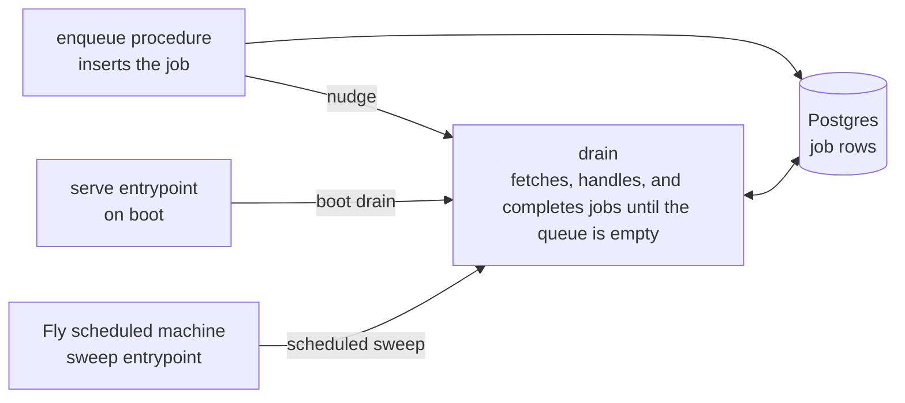

# Queues

Durable background work runs on Postgres-backed job queues. pg-boss is the queue engine, and every
package consumes it only through the queue wrapper, `@vers/jobs`. Work that needs no durable
delivery, no retry with backoff, and no dead-letter trail does not belong on a queue. The email
service is the only consumer today.

## The wrapper

The queue wrapper is the only module that imports pg-boss. A job definition pairs a zod payload
schema with the job's retry, dead-letter, and expiry policy. Its name doubles as the queue name.
Every defined job needs a handler, which receives the schema-parsed payload and the job id. The
queue handle carries the pg-boss lifecycle, one validating enqueue, and one drain. The enqueue
validates the payload before it inserts and can route the insert through the caller's Kysely
transaction, so job creation commits or rolls back with the domain write it belongs to. A drain
fetches, handles, and completes in batches until its queue is empty, covers every defined queue when
called with no name, and fails a stored payload that no longer parses without reaching the handler.
pg-boss owns its own schema in the shared database and migrates it itself at start, so the schema
migrations never touch it.

## Delivery model: drains, not resident workers

Fleet services scale to zero when idle, and Neon suspends the database. A resident polling worker
would hold both awake around the clock, so delivery rides three one-shot drains instead:

- Nudge: an enqueue procedure fires a drain fire-and-forget after the insert. The machine handling
  the request is already awake, so delivery lands at once. A deadline-bearing job's enqueue keeps
  re-draining its queue every few seconds until that job reaches a terminal state or its deadline
  passes, capped at eight minutes.
- Boot drain: the serve entrypoint drains on start, catching jobs enqueued while the process was
  down.
- Scheduled sweep: a Fly scheduled machine runs the service's sweep entrypoint, which starts the
  queue, drains to completion, and exits. It catches retries whose delay elapsed while no machine
  was awake, and anything a crash orphaned. The deploy CLI declares and reconciles the machine
  ([deployment](./deployment.md#scheduled-machines)).

Durability lives in Postgres, so a job between drains is late, never lost. A queue-hosting service
stops rather than suspends when idle, because pg-boss's maintenance loop does not recover from the
clock jump a resumed machine sees. A stopped machine boots clean, so every wake re-runs the boot
drain.

## Retries and failure

A handler throw fails the job, and pg-boss keeps it invisible until its retry delay elapses,
doubling that delay per attempt when the definition asks for backoff. A job that exhausts its retry
limit on a dead-lettering definition moves to a dead queue named after its own. Handlers make
outbound effects idempotent with the job id, so at-least-once delivery never doubles an effect; the
email service sends the job id as its provider's idempotency key. A job whose payload carries a
useful-until deadline is never delivered past it: the handler completes such a job unsent and counts
the drop. pg-boss pools its own connections, so a queue test takes database isolation rather than an
injected transaction.
