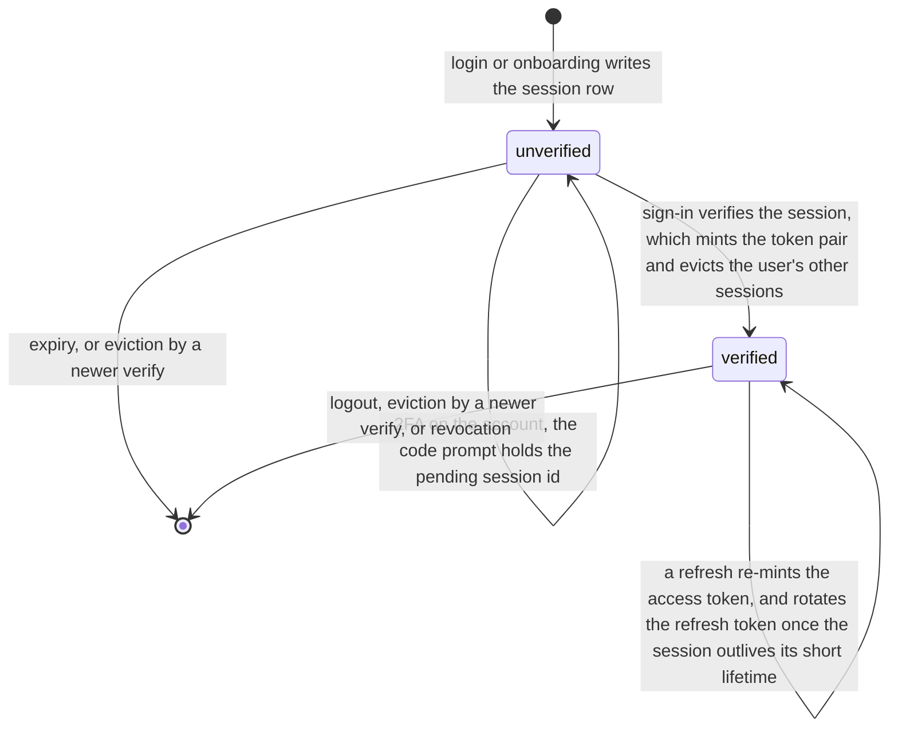
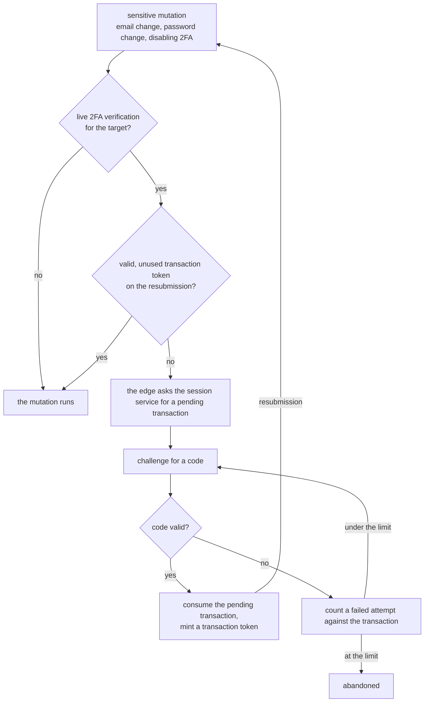

# Auth

The web edge and the domain services split authentication and step-up authorization by role. The
edge runs the credential and code flows, holds the session cookie, and signs the service-to-service
token for its own outbound calls. Durable state lives in the services: sessions and step-up
transactions in the session service, password credentials and reset tokens in the user service, TOTP
verifications in the verification service. Services never see cookies. The edge validates the
session and passes each service a short-lived token naming the acting user, so a service trusts the
token's claims and nothing else ([service contracts](./service-contracts.md)).

## Session lifecycle

A login validates the honeypot and the fields, then checks the email and password against the user
service. A wrong email or password reports one form-level error, never which was wrong. The session
service then writes an unverified session row, with a longer lifetime when the player asks to be
remembered. With 2FA on the account, the edge redirects to the code prompt carrying the pending
session id; without it, sign-in completes directly. Onboarding creates the user, then the session,
then completes the same sign-in. An onboarding retry that finds the email already taken checks the
submitted password: a match signs the player in through the same path, and a mismatch reports that
the account exists.

Sign-in redirects to a force-logout prompt when the account already holds a live session; otherwise
it verifies the session and seals the cookie. Verifying a session mints the first access and refresh
token pair, marks the row verified, and evicts every other session of the same user in one
statement, so at most one verified session per user survives. Each token is a JWT subject-bound to
the user and signed with the session service's private key. The edge verifies the access token's
signature against the session service's published key set, selected by the token's key id, and
requires the token's subject to match the cookie's user before it trusts any claim; a token no
published key signed, or whose subject is not the cookie's user, reads as signed out. Access tokens
are short-lived. A refresh call re-mints the access token, and rotates the refresh token only once
the session has outlived its short lifetime. A reused refresh token, a superseded rotation, or an
expired session revokes the session. A signing key rotates through an overlap window in which the
service signs with the new key and publishes both, and a refresh token is matched against the
session row rather than verified by signature, so a rotation never invalidates a live session. A
service token can outlive its session by its own short lifetime, so the edge re-confirms the session
still exists on every request while the access token is fresh, and an evicted device is signed out
on its next request.

The session cookie is httpOnly, same-site lax, secure in production, and sealed by an app secret.
Reading it never throws, and an absent token is how the edge observes "signed out". A partial
session, one missing any of the session id, access token, or refresh token, reads the same way. The
edge runs the logout path before it redirects to login. A service's `UNAUTHORIZED` on a page load's
server call takes the same logout path and redirect.

## Step-up authorization

A sensitive mutation runs behind a fresh code check when its target has live 2FA verification.

One handler verifies the challenge for every gated mutation, and a valid code consumes the pending
transaction atomically.

A pending transaction lives in postgres with its action, target, IP, and owning session. Postgres
cascade-deletes it with the session. The session service ignores an expired row at consume time and
sweeps expired rows on the next create, and consuming a row rejects a request whose action, IP,
session, or target does not match it.

The transaction token is a short-lived JWT minted and verified only inside the edge process, against
a per-process in-memory keypair, because it round-trips through the browser between the code check
and the mutation. It is proof a code check passed, redeemable once by the mutation it names. The
session service records each consumed token id and rejects a repeat, and the check matches the
token's session before consuming it, so a token minted under one session cannot redeem under
another.

## TOTP verification

The verification service issues and checks TOTP codes, one verification row per target and type. An
emailed code (onboarding and an email change) carries an expiry; an authenticator code (2FA and 2FA
setup) lives one TOTP period. Verifying consumes an emailed code on success and deletes its row. An
authenticator row stays and records its last verified code and time, so a repeat of the same code
matches zero rows. The service also returns the authenticator-app URI for a pending 2FA setup.

## Credentials and password reset

The user service owns the credential path: it verifies a password at login, a password change
rewrites the hash and leaves the sessions in place, and a password reset rewrites the hash and
deletes every session of that user. It stores a reset token as its hash, the token reaches the user
only through the URL in the reset email, and the reset matches it in constant time.

## Service-to-service tokens

Every service call over the private network carries a short-lived JWT signed with an Ed25519
keypair. The issuer claim and the key id both name the minting service, the subject names the acting
user and is omitted for a verified-anonymous call, a session claim names the acting session, and the
audience is the target service's registered audience. Every issuer holds its own private key, held
by no other app: the web edge for its outbound calls, the replay service for its calls toward the
keys service and the version-pinned replay providers, and the activity service for the wake call a
committed append sends toward the replay service.

The service runtime verifies every inbound token before any handler runs, against a key set
registering every issuer's public key under its key id. A token's claimed issuer must be a known
issuer and equal its key id, and the signature validates only against that issuer's registered key.
Each service declares the issuers it accepts, so a leaked minting key reaches only the services that
name its issuer. The runtime rejects a bad token with a plain 401 and a token from an issuer the
service does not accept with a plain 403 ([service contracts](./service-contracts.md)).
